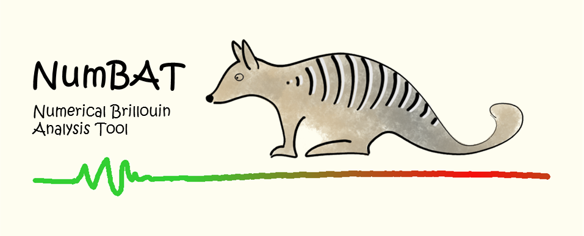

.. role:: raw-math(raw)
    :format: latex html

Introduction
================

NumBAT, the Numerical Brillouin Analysis Tool, integrates electromagnetic and acoustic mode solvers to calculate the interactions of optical and acoustic waves in waveguides.

Goals
================
NumBAT is designed primarily to calculate the optical gain response from
stimulated Brillouin scattering (SBS) in integrated waveguides. It uses finite element algorithms
to solve the electromagnetic and acoustic modes of a wide range of 2D waveguide structures. It
can account for photoelastic/electrostriction and moving boundary/radiation pressure effects, as well as
uniaxial optical anisotropy and general acoustic anisotropy. 

NumBAT also supports user-defined material properties and we hope its creation will drive a community-driven
set of standard properties and geometries which will allow all groups to test and validate each other's
work.

A full description of the NumBAT physics and numerical algorithms  is available in an arxiv paper submitted
in September 2017.

NumBAT is open-source software and the authors welcome additions to the code.  Details for how
to contribute are available in :ref:`sec-contribute-label`.

Development team
================
NumBAT was developed by Bjorn Sturmberg, Kokou Dossou, Blair Morrison, Chris Poulton and Michael Steel in a collaboration between Macquarie University, the University of Technology Sydney, and the University of Sydney, as part of the Australian Research Council Discovery Project DP160101691.

